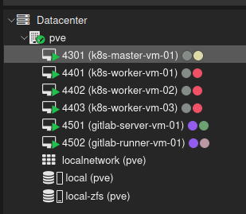
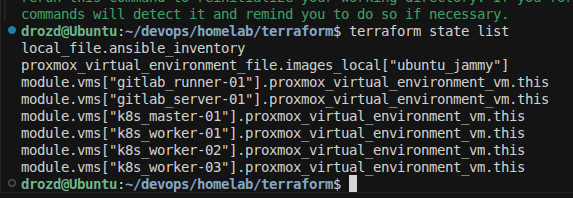

# Итоговый проект модуля «Облачная инфраструктура. Terraform»

**Дисклемер**

В связи с переходом из другой группы мои квоты в YC закончились.
Я постарался адаптировать свои домашние эксперименты на proxmox под текущее задание.
Многие вещи в рамках моего домашенго проекта не имеют смысла и сделаны исключительно для соответствия заданию.
По представленным ниже ссылкам существует документация к проекту, здесь же я постарался изложить для понимания проделанной работы только то, что мною было добавлено именно для ДЗ.

## Связанные репозитории


| Путь / проект                                                                              | Роль                                                        |
| ------------------------------------------------------------------------------------------ | ----------------------------------------------------------- |
| [homelab](https://github.com/VeselijDrozd/homelab) / GitLab `homelab/homelab`              | Инфраструктура: Terraform, Ansible, манифесты K8s, CI инфры |
| [terraform-proxmox-vm-module](https://github.com/VeselijDrozd/terraform-proxmox-vm-module) | Переиспользуемый модуль создания ВМ в Proxmox               |
| [surfhouse](https://github.com/VeselijDrozd/surfhouse)                                     | Cвое тестовое web-приложение с API + CI/CD в кластер        |


---

## Соответствие: Yandex Cloud → Homelab


| Пункт задания (YC)                 | Реализация в homelab                                                                |
| ---------------------------------- | ----------------------------------------------------------------------------------- |
| VPC                                | Сеть гипервизора Proxmox, bridge `vmbr0`                                            |
| Подсети                            | Адресное пространство LAN `10.10.10.0/24`, статические IP через cloud-init          |
| VM + security groups (22, 80, 443) | ВМ через Terraform; аналог SG — UFW в примере user-data; снаружи HTTP через Ingress |
| Managed MySQL                      | MariaDB в Kubernetes (`website`), пароль из GitLab Variable                         |
| Container Registry                 | GitLab Container Registry                                                           |
| user-data → Docker/Compose         | Пример `cloud-init-docker-compose.yaml`; на k8s-нодах — containerd (Ansible)        |
| Dockerfile → Registry              | Multi-stage Dockerfile + push из GitLab CI                                          |
| Приложение ↔ БД                    | Статика + Flask API (`/api/hits`) → MariaDB                                         |
| LockBox                            | Аналог: GitLab CI Variable `DB_PASSWORD` → K8s Secret                               |


---

## Задание 1. Инфраструктура

### Что было изначально

- Terraform (`homelab/terraform`) создаёт ВМ в Proxmox через модуль `terraform-proxmox-vm-module`.
- cloud-init на ВМ: пользователь, SSH-ключ, IPv4.
- Сеть: bridge `vmbr0`, адреса вида `10.10.10.x` (inventory Ansible).
- Кластер Kubernetes (kubeadm) поднимается Ansible-плейбуком; runtime — **containerd**, не Docker.
- Приложение и мониторинг — манифесты/Helm в `homelab/k8s/`.
- State Terraform хранился **локально** (`backend "local"`).
- Отдельных «security groups» как в YC не было.




### VPC и подсети (адаптация)

В Proxmox нет сущности VPC как в YC. Эквивалент:

- **VPC** — L2/L3 сегмент лаборатории (bridge `vmbr0` на узле PVE).
- **Подсеть** — `10.10.10.0/24`, адреса ВМ задаются в Terraform/`tfvars` и применяются cloud-init.

### Виртуальные машины

ВМ описываются в `vm_groups` / `vms`, разворачиваются [модулем](https://github.com/VeselijDrozd/terraform-proxmox-vm-module). После apply генерируется [ansible/inventory.ini](https://github.com/VeselijDrozd/homelab/blob/master/terraform/inventory.tf).

Группы в лаборатории (по inventory): `k8s_master`, `k8s_worker`, `gitlab_server`, `gitlab_runner`.

### Группы безопасности (порты 22, 80, 443)

**Изначально:** доступ по SSH ключом; веб-трафик к приложению — через Ingress NGINX (хост `surfhouse.local`), снаружи при необходимости NodePort **30080**.

**Добавлено для соответствия заданию:** [пример user-data](https://github.com/VeselijDrozd/homelab/blob/master/terraform/examples/cloud-init-docker-compose.yaml) — правила UFW:

- 22/tcp (SSH)
- 80/tcp (HTTP)
- 443/tcp (HTTPS)

На уже работающих k8s-нодах этот фрагмент **намеренно не накатывался** (чтобы не ломать containerd/кластер). Для домашки — демонстрационный аналог security group; для отдельной demo-ВМ его можно применить как snippets/user-data.

### База данных MySQL

**Было:** отдельной СУБД не было в принципе. Был просто одностраницный сверстанный шаблон в качестве тестого веб-приложения.

**Стало:** MariaDB 11 в namespace [website](https://github.com/VeselijDrozd/homelab/blob/master/k8s/01-website/mariadb.yml).  
Пароль — только из Secret `surfhouse-db` (создаётся из CI Variable `DB_PASSWORD`).

MariaDB

### Container Registry

**Изначально уже было:** GitLab Container Registry
GitLab CR

Сборка и push — job `build-image` в [surfhouse/.gitlab-ci.yml](https://github.com/VeselijDrozd/surfhouse/blob/main/.gitlab-ci.yml).  
В кластере — `imagePullSecrets: gitlab-registry`.

Аналог **Yandex Container Registry**.

### Remote state (важное усиление к заданию 1)

**Было:** `backend "local"`. Инфраструктурный код не заливался в gitlab, не использовался CI. Все делалось вручную.

**Стало:**

- GitLab Managed Terraform State (`backend "http"`).
- Проект GitLab: `homelab/homelab`, имя state: `homelab`.
- Локальные креды: gitlab_http_backend_cred.sh (gitignore).
- CI инфры: `.gitlab-ci.yml` — `fmt` → `validate` → `plan` → ручной `apply`.
- Модуль ВМ подключается по git-ref (`v1.1.2`), чтобы runner не зависел от sibling-каталога.

pipeline

---

## Задание 2. user-data (cloud-init): Docker и Docker Compose

### Что было изначально

В модуле ВМ cloud-init настраивал только учётную запись и сеть.  
Docker Compose на k8s-нодах не ставился: для Kubernetes используется **containerd** (роль Ansible [k8s_node](https://github.com/VeselijDrozd/homelab/blob/master/ansible/roles/k8s_node/tasks/main.yml)).

### Что добавлено

Файл-пример:

[cloud-init-docker-compose.yaml](https://github.com/VeselijDrozd/homelab/blob/master/terraform/examples/cloud-init-docker-compose.yaml)

Он:

1. Ставит `docker.io` и `docker-compose-v2`.
2. Включает сервис Docker.
3. Открывает порты 22/80/443 через UFW (см. задание 1).

Это прямой ответ на формулировку задания про user-data.  
В «боевом» контуре лаборатории эквивалент подготовки runtime — **Ansible**, а запуск приложения — **Kubernetes**.

Дополнительно для локальной демонстрации Compose: `[docker-compose.yml](https://github.com/VeselijDrozd/surfhouse/blob/main/docker-compose.yml)`.

Задание ориентировано на Compose, но у меня в домашнем проекте кластер:


| Учебный минимум                          | Фактический прод лаборатории                                              |
| ---------------------------------------- | ------------------------------------------------------------------------- |
| `docker-compose.yml` + cloud-init пример | Deployment `surfhouse`, **3 реплики**, Service, Ingress, GitLab CI deploy |


## Я решил не рушить, Compose оставлен как упрощённый стенд; оркестрация — Kubernetes.

## Задание 3. Dockerfile и сохранение образа в Registry

### Что было изначально

Простой Dockerfile:

```dockerfile
FROM nginx:latest
COPY . /usr/share/nginx/html
...
```

Образ уже пушился в GitLab Registry пайплайном `surfhouse`.

### Что изменено

1. **Multi-stage Dockerfile** в `surfhouse/`:
  - stage `build` (alpine) — подготовка статики;
  - stage runtime — `nginx:1.27-alpine`, копирование артефакта.
2. `**docker-compose.yml`** — локальный запуск `docker compose up --build`.
3. Пайплайн без смены логики: `docker build` → `docker push` в Registry.

В целом, как я описывал в самом начале, для моего приложения Multi-stage вроде бы не имеет смысла, но для задания демонстрируется сам принцип.

---

## Задание 4. Приложение ↔ БД

### Что было изначально

Только статический nginx; к БД приложение не обращалось.
Для прикручивания БД пришлось придумать что-то помимо статичной страницы.

### Что сделано

1. Мини-API на Flask (`surfhouse/api/`): `GET /api/hits` увеличивает счётчик в таблице `hits` и возвращает JSON.
2. Лендинг вызывает `/api/hits` (JS в `index.html`) и показывает «visitors: N».
3. Ingress: `/api` → `surfhouse-api`, `/` → статика.
4. Локально: `docker compose up --build` (сайт + API + MariaDB).

---

## Задание 5* (опционально). Секреты / аналог LockBox

**Yandex LockBox** — отдельный secrets manager. Полный Vault/LockBox не ставился.

### Прямой аналог для пароля БД

```text
GitLab CI Variable DB_PASSWORD (Masked)
        → deploy job
        → kubectl create secret generic surfhouse-db
        → MariaDB и API читают password через secretKeyRef
```

Дополнительно: gitignore для `tfvars` / cred-скриптов; CI File variables для kubeconfig и Terraform.

---

## Итого: что я изменил под задание (чеклист)

- Remote state → GitLab Managed Terraform State + CI plan/manual apply  
- Пример security group (UFW 22/80/443) в user-data  
- Пример cloud-init с Docker + Compose  
- Multi-stage Dockerfile + compose-файл приложения  
- Container Registry — уже был, описан.  
- MariaDB + API + привязка лендинга (`/api/hits`)  
- Аналог LockBox — GitLab Variable `DB_PASSWORD` → K8s Secret

---